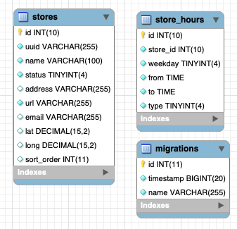

# Coding Assignment

The goal of this assignment is to showcase your ability to develop features in an existing codebase and your coding style. 

Even though the app is small, one can easily spend the whole week working on it: perfecting styles, testing every single method, or carefully crafting every single line of code. Please don't! Do as much as you can in about 3-4 hours and share the results.

The most important part of the interview will come after this one, when we look at the app together, talk about the decisions you have made, etc..

## Submitting your solution

Create an archive without `node_modules` folder and send it to the person of contact. We will continue to work on it during the next interview sessions. Please also indicate approximately how long you spent on the submission.

## Local development

1. Clone repository locally
2. Run `npm install`
3. Check the `.env` to make sure you don't have port collisions
4. Start a temporary mysql instance and import dump, we've been using mysql 5.7
5. Run `npm run db:seed` to import dump
6. Run `npm run start:dev` to start the application
7. Open `http://localhost:3000` (or the port you specified) in browser to see it working

## Running Test

```bash
# unit tests
$ npm run test

# e2e tests
$ npm run test:e2e

# test coverage
$ npm run test:cov
```

# Database schema



Please review the schema and feel free to make any changes as you see fit.

# Assignments
Current application shows a list of stores with a list of filters (which you are going to implement). Because a restaurant chain can have a lot of stores, the client should be able to apply filters to find the best match. The filters include a search by store name, search by geolocation (the distance from client and stores) as well as by store working hours by weekday.

#### 1. Implement infinite scroll for stores using pagination
You can pick whatever solution or library you have in mind

#### 2. Implement filters on frontend
To implement following features:
- sort by nearest store
- filter by store name
- filter by store hours of the week
Some of these filters already have a boilerplate that you can use. Others you should implement by yourself.

#### 3. Modify get stores API to include pagination and additional query params
should match this schema: `GET: /api/stores?offset=0&limit=15&searchQuery=starbucks&lat=51.5285582&lng=-0.2416795&weekday=1&startHour=10:00&endHour=18:00`

| param | type | default | description |
|-------|------|---------|-------------|
|offset |number|0        |*Optional*. The offset of the first item in the collection to return|
|limit  |number|15       |*Optional*. The maximum number of entries to return|
|searchQuery|string|     |*Optional*. Filter stores by name|
|lat/lng|number|         |*Optional*. Location of the user|
|weekday|number|current week day|The day of the week index; Monday = 1, Sunday = 7|
|startHour|string|       |*Optional*. The store opening working hours|
|endHour|string|         |*Optional*. The store closing working hours|

It should be possible to search by multiple filters. Apply them in this priority:
- sort by distance if `lat` and `lng` is provided
- default: use the `sortOrder` field from `stores` table


#### 4. Export all stores to a csv file
Create a new endpoint that will download all stores to a csv file in browser. When designing a solution, be aware that we have 500000 stores in the provided database.

#### 5. Write some unit tests

